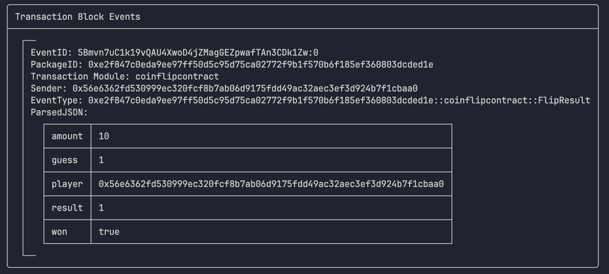

# claim coin

> sui client call --package 0xe2f847c0eda9ee97ff50d5c95d75ca02772f9b1f570b6f185ef360803dcded1e \
>    --module coinflipcontract \
>    --function claim \
>    --args \
>        0xc149b3f9e32d13cdfadc5818d52613bbe3e8d5222e2a248d0c93a03796812fd4 \
>        0x841e23d2dfa20e58bea45ee33e2e5de1d7a0514ac91b1496bdc52b3793f045d6 

# play

> sui client call --package 0xe2f847c0eda9ee97ff50d5c95d75ca02772f9b1f570b6f185ef360803dcded1e \
>    --module coinflipcontract \
>    --function play \
>    --args \
>        0xc149b3f9e32d13cdfadc5818d52613bbe3e8d5222e2a248d0c93a03796812fd4 \
>        0x8 \
>        1 \
>        10 \
>        0xe61280f521313eafdc8c09585516557a278393dbc5389dfa2ddb6d4bd4916499

